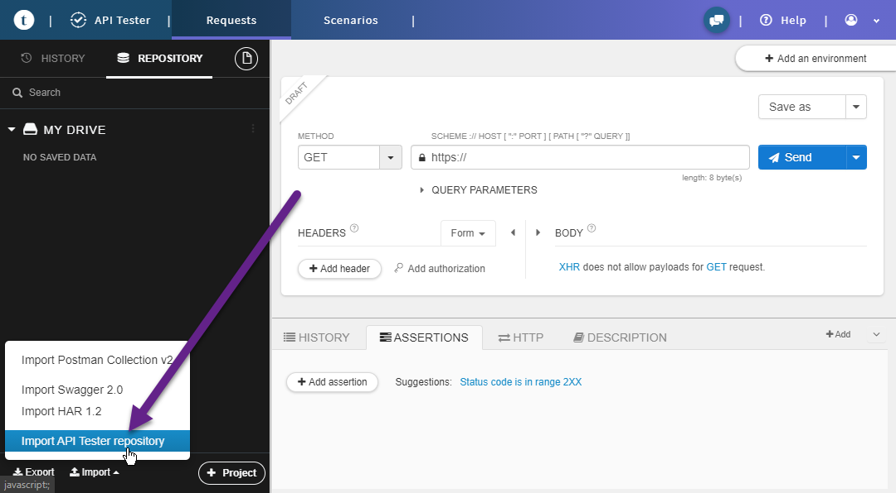

# Как установить айкод апи

АПИ работает основано на контейнере докер. Вам нужно убедиться что докер установлен на вашем ПК.

## Системные требования

Что бы выполнить условия этой инструкции, ваша среда должна соответствовать следующим параметрам

- Установлен Node.js 10.0+
- Установлен Docker
- Установлен composer
- Если на Windows 10 то WSL2

## Установка

1.  Сделайте Fork на репозиторию API.
2.  Клонируйте созданную ветку себе на компьютер.
3.  Откройте MySql и создайте базу данных по имени `icod_app`.
4.  Перейдите в командную строку, зайдите в корень проекта и последовательно выполните следующие команды.

        npm install
        npm link
        composer install

5.  Убедитесь что файлы `tools\cli\db_dump.php` и `tools\cli\db_restore.php` есть разрешение на запуск из командной строки.

        chmod +x ./tools/cli/db_dump.php
        chmod +x ./tools/cli/db_restore.php

6.  Откройте файл `configs\config.php` и отредактируйте константу `DB_DEV` для подключения к ваше базе данных.

7.  Восстановите базу данных командой.

        php ./tools/cli/db_restore.php -d icod_app -e=dev

    Подробнее об этом команде в отдельной статье.

8.  Запустите докер контейнер. Сначала создайте образ.

        docker image build -t icod_api:latest .

    Это нужно сделать всего один раз. Не нужно это делать при каждом запуске. Создавать новый контейнер нужно только если изменился файл Dokerfile. Что бывает крайне редко.

    Теперь запустить контейнер.

        docker container run --publish 8001:8081 --network=bridge --mount source=icod,target=/var/log/icod -v /path/to/icod-api:/var/www/localhost -d --name icod-api icod_api:latest

    Запустив контейнер один раз, потом можно просто останавливать его и запускать уже из докера.

    Порт 8001 это тот порт на который будет обращаться веб приложение.

## Проверка API

Есть много разных HTTP клиентов которые позволят вам отправлять запросы к серверу и просматривать ответы. Любой REST API клиент подойдет. Главное правило тут:

1. Нужно добавить заголовок `Content-Type: application/json`
2. Слать только `POST` запросы
3. Передавать параметры в теле POST запроса как текст JSON

Но если вы пользуетесь браузером Chrome, мы рекомендуем пользоваться расширением [Talend API Tester - Free Edition](https://chrome.google.com/webstore/detail/talend-api-tester-free-ed/aejoelaoggembcahagimdiliamlcdmfm). Во первых он очень продвинут в плане возможностей, а так же позволяет загружать и выгружать точки доступа API в JSON файл.

1. В нижнем левом углу есть кнопка импорта. Нажмите ее, перейдите в корень проекта, потом `configs\dhc_chrome.json` и загрузите его.
2. Раскроите дерево методов, и найдите App\Module Language. Кликните на нем что бы он загрузился.
3. Вы должны увидеть результат выполнения метода. Если это произошло то все работает нормально.
